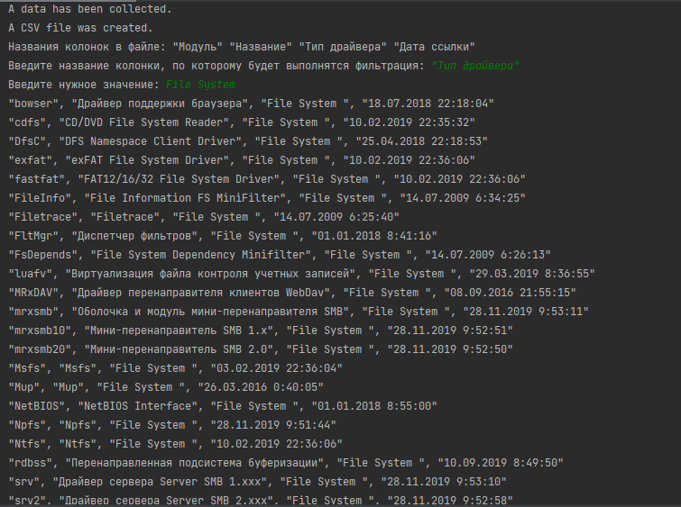

# Introduction
This is a python script with the following functions:
- running 'driverquery' command in cmd;
- saving an output in a csv file;
- filtering by columns in the csv file.

#Usage

    python filtered_driverquery_csv.py

#Example
Filtering example by driver type "File System": 

